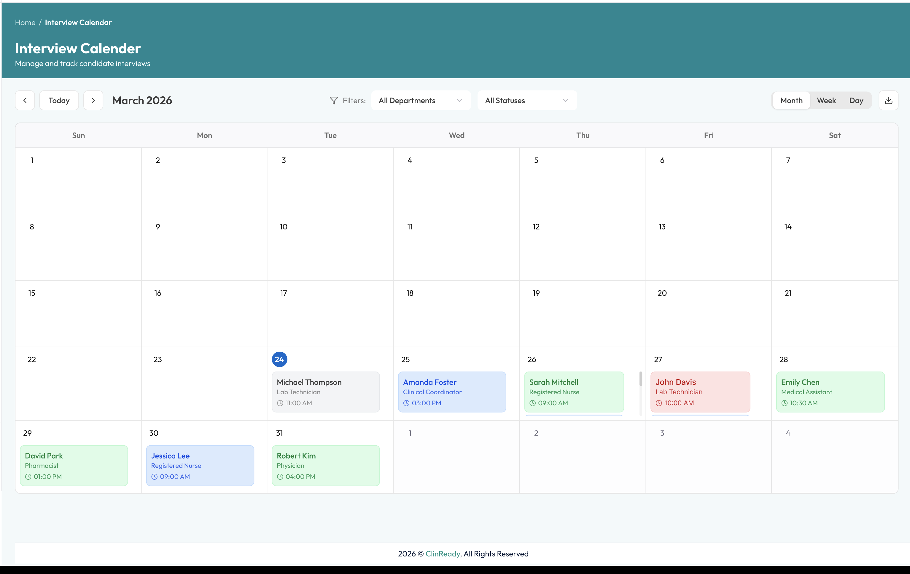
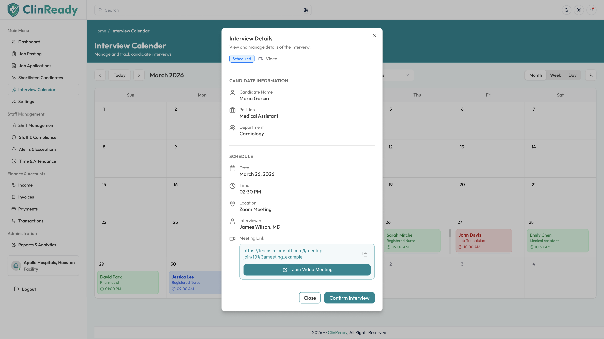
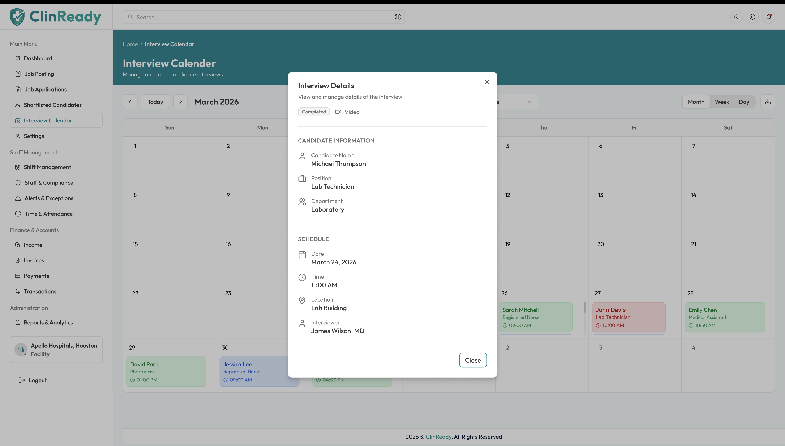
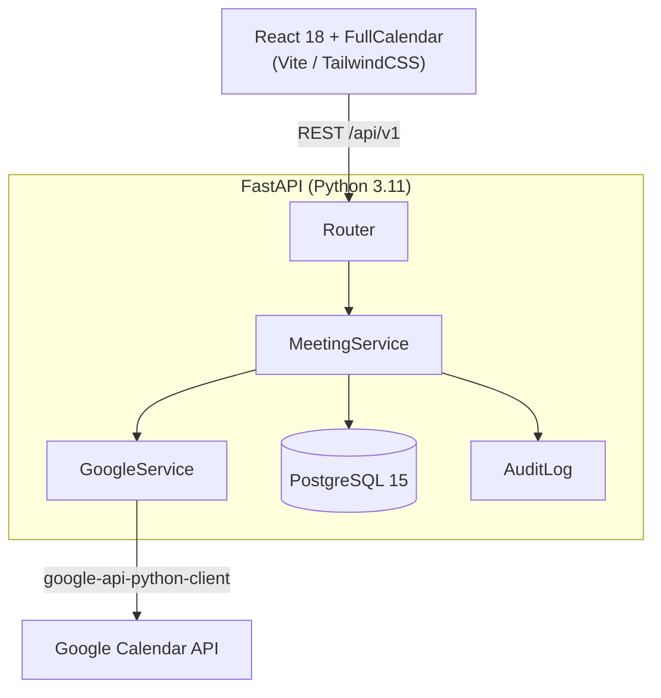

# Interview Calendar Module

A production-ready **Interview Calendar** for healthcare HR teams: schedule, track, and manage candidate interviews with Google Calendar / Meet integration, department filtering, and a smooth React UI.

---

## Screenshots

| Calendar View | Interview Details (Scheduled) | Interview Details (Completed) |
|---|---|---|
|  |  |  |

---

## Features

- **Month / Week / Day** calendar views powered by FullCalendar
- Color-coded status cards: Scheduled · Completed · Cancelled · Rescheduled
- **Schedule, Reschedule, Cancel, Complete** interviews with a state-machine guard
- Google Calendar event creation + Google Meet link generation
- Department & status filter bar
- Interviewer management
- Audit log trail for every status change
- **JWT** auth via Google OAuth 2.0
- `.ics` export
- Seed data for realistic demo (12 candidates, March 2026)

---

## Architecture



---

## Project Structure

```
.
├── backend/
│   ├── app/
│   │   ├── api/v1/         # REST endpoints
│   │   ├── core/           # config, security, logging
│   │   ├── db/             # session, seed
│   │   ├── models/         # SQLAlchemy ORM
│   │   ├── schemas/        # Pydantic v2
│   │   └── services/       # business logic, Google integration
│   ├── alembic/            # DB migrations
│   └── tests/
└── frontend/
    └── src/
        ├── components/
        │   ├── calendar/   # CalendarView, MeetingCard, FilterBar
        │   ├── layout/     # Sidebar, TopHeader
        │   └── meeting/    # MeetingDetailsModal, CreateMeetingModal
        ├── pages/          # InterviewCalendar
        ├── lib/            # api client, utils
        └── types/          # TypeScript interfaces
```

---

## Local Development

### Prerequisites

- Python 3.11+, `pip`
- Node 20+, `npm`
- PostgreSQL 15 (or Docker)
- Google Cloud project with **Calendar API** enabled and an OAuth 2.0 client

---

### 1. Clone & configure

```bash
git clone <repo-url>
cd email
```

**Backend**
```bash
cp backend/.env.example backend/.env
# Edit backend/.env — fill DATABASE_URL, SECRET_KEY, GOOGLE_CLIENT_ID, GOOGLE_CLIENT_SECRET
```

**Frontend**
```bash
cp frontend/.env.example frontend/.env
# Edit frontend/.env — set VITE_API_URL=http://localhost:8000
```

---

### 2. Run with Docker Compose (recommended)

```bash
docker compose up --build
```

- Frontend → [http://localhost:5173](http://localhost:5173)
- Backend → [http://localhost:8000](http://localhost:8000)
- API docs → [http://localhost:8000/docs](http://localhost:8000/docs)

---

### 3. Run manually

**Backend**
```bash
cd backend
pip install -e ".[dev]"
alembic upgrade head
python -m app.db.seed          # optional demo data
uvicorn app.main:app --reload
```

**Frontend**
```bash
cd frontend
npm install
npm run dev
```

---

## Google Cloud Setup

1. Go to [Google Cloud Console](https://console.cloud.google.com) → **APIs & Services → Library**
2. Enable **Google Calendar API**
3. Create **OAuth 2.0 Client ID** (Web application)
4. Add authorised redirect URI: `http://localhost:8000/api/v1/auth/google/callback`
5. Copy **Client ID** and **Client Secret** into `backend/.env`

---

## API Reference

| Method | Path | Description |
|--------|------|-------------|
| `GET` | `/api/v1/meetings` | List meetings (filter: department, status, date_from, date_to) |
| `POST` | `/api/v1/meetings` | Create meeting |
| `GET` | `/api/v1/meetings/{id}` | Get single meeting |
| `PATCH` | `/api/v1/meetings/{id}` | Update meeting |
| `POST` | `/api/v1/meetings/{id}/cancel` | Cancel meeting |
| `POST` | `/api/v1/meetings/{id}/complete` | Complete meeting |
| `GET` | `/api/v1/meetings/{id}/audit` | Audit log |
| `GET` | `/api/v1/users/interviewers` | List interviewers |
| `GET` | `/api/v1/departments` | List departments |
| `GET` | `/api/v1/auth/google` | Start OAuth flow |
| `GET` | `/api/v1/auth/google/callback` | OAuth callback |

Interactive docs available at `/docs` (Swagger UI) and `/redoc`.

---

## Interview State Machine

```
SCHEDULED ──► COMPLETED   (terminal)
           ├─► CANCELLED   (terminal)
           └─► RESCHEDULED ──► SCHEDULED
```

---

## Tech Stack

| Layer | Technology |
|-------|-----------|
| Frontend | React 18, TypeScript, Vite, TailwindCSS, FullCalendar, @tanstack/react-query |
| Backend | Python 3.11, FastAPI, SQLAlchemy 2 (async), Alembic, Pydantic v2 |
| Database | PostgreSQL 15 |
| Auth | Google OAuth 2.0, JWT (python-jose) |
| Calendar | google-api-python-client |
| CI | GitHub Actions |

---

## License

MIT © 2026
